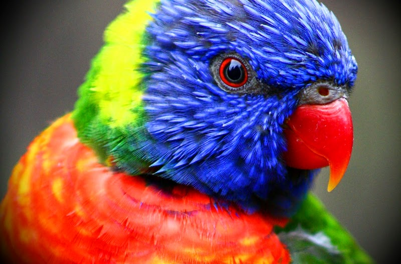

# Daniel Pinto 15-11139, Pedro Rodriguez 15-11264

## Detalles de la implementacion.

Nuestra implementacion hace distincion entre 3 tipos de capas:

  
   <figcaption>Error por iteracion para el clasificador multiclase con una capa oculta</figcaption>

## Parte 3: Segmentación de Imagenes

Las imagenes escogidas para esta parte son las siguientes:

  
   <figcaption style="text-align: center;">4 círculos de color</figcaption>

  
   <figcaption style="text-align: center;">Loro colorido</figcaption>

Siendo la primera escogida por su simplicidad y estar compuesta por únicamente 5 colores planos (blanco, verde, azul, morado y amarillo), y la segunda debido a su complejidad y variedad de colores. Los experimentos se realizaron para $k=2$ $k=3$ $k=4$ $k=5$ $k=10$ $k=20$ y $k=40$, cada uno con un máximo de $300$ iteraciones.

## Imágenes resultantes

### Imagen 1

  
   <figcaption style="text-align: center;">Imágen 1 k=2</figcaption>

  
   <figcaption style="text-align: center;">Imágen 1 k=3</figcaption>

  
   <figcaption style="text-align: center;">Imágen 1 k=4</figcaption>

  
   <figcaption style="text-align: center;">Imágen 1 k=5</figcaption>

  
   <figcaption style="text-align: center;">Imágen 1 k=10</figcaption>

  
   <figcaption style="text-align: center;">Imágen 1 k=20</figcaption>

  
   <figcaption style="text-align: center;">Imágen 1 k=40</figcaption>

### Imagen 2

  
   <figcaption style="text-align: center;">Imágen 2 k=2</figcaption>

  
   <figcaption style="text-align: center;">Imágen 2 k=3</figcaption>

  
   <figcaption style="text-align: center;">Imágen 2 k=4</figcaption>

  
   <figcaption style="text-align: center;">Imágen 2 k=5</figcaption>

  
   <figcaption style="text-align: center;">Imágen 2 k=10</figcaption>

  
   <figcaption style="text-align: center;">Imágen 2 k=20</figcaption>

  
   <figcaption style="text-align: center;">Imágen 2 k=40</figcaption>

En general, podemos observar que mientras tengamos una mayor cantidad $k$ de clusters, la imagen generada tra aplicar k-means va a tener mayor detalle y profundidad de colores, sin embargo destaca la paleta de colores obtenidas para ambas imágenes. Para la imagen 1, la paleta de colores obtenida parece corresponder a aquellos tonos que pueden encontrarse de manera significativa en esta, y unicamente para $k<=5$ obtenemos coloraciones que no corresponden a la imagen, probablemente debido a que no se crean suficientes clusters para agrupar los distintos colores de la imagen en sus propios grupos, teniendo que generarse así un color calculado con la media. Adicionalmente, los bordes de las figuras parecen siempre variar entre más de un cluster, generando una especie de ruido delimitador (curiosamente como una especie de edge detection) en la frontera entre 2 colores que parece ser consecuencia de que los píxeles en el contorno de los círculos probablemente tengan un degradado imperceptible para el ojo humano. 

Los resultados de la imagen 2 tienen un comportamiento similar a la primera pero con un efecto mucho más notorio debido a la extrema variedad y complejidad de los colores disponibles en esta. Al haber una gran variedad de colores en la imagen, no se crea una cantidad de clusters suficientemente representativa para todas las coloraciones, por lo que los centroides obtenidos tienen un coloración marrón. Una analogía que parece adecuada para los colores obtenidos, es que si tomamos pinturas/plastilinas de distintos colores y las mezclamos, vamos a obtener un color grisaceo/marrón.